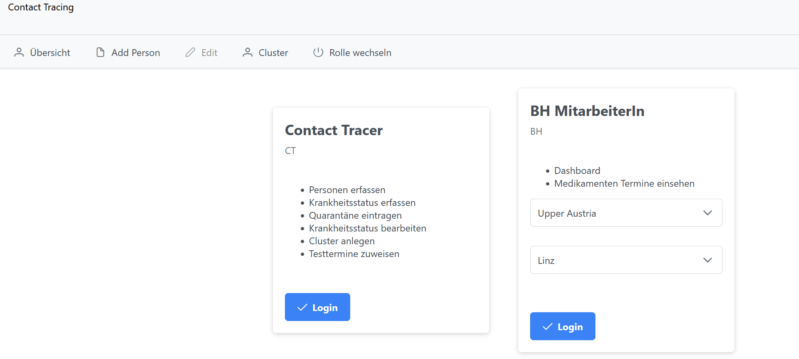
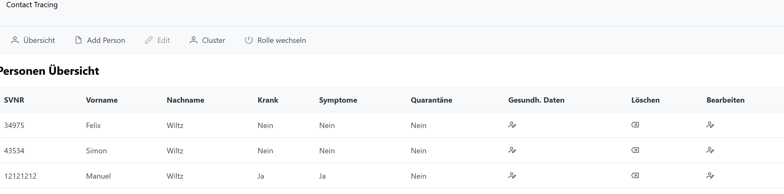
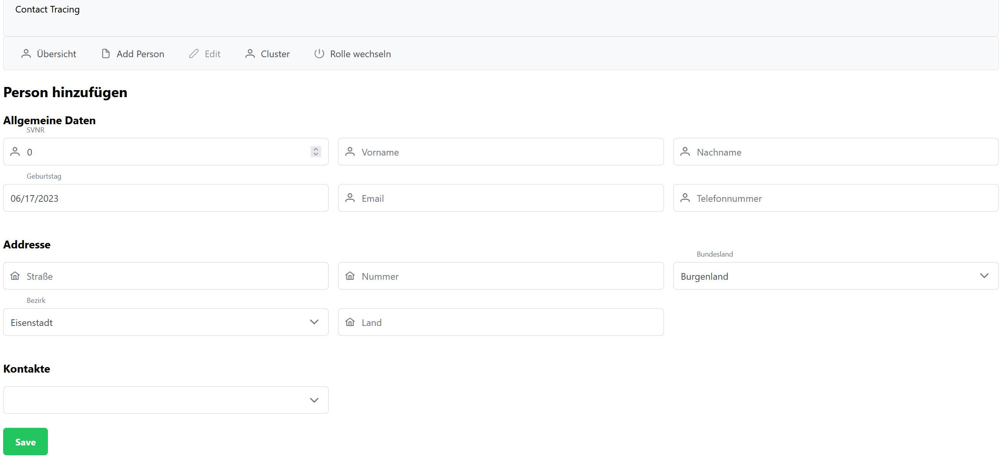
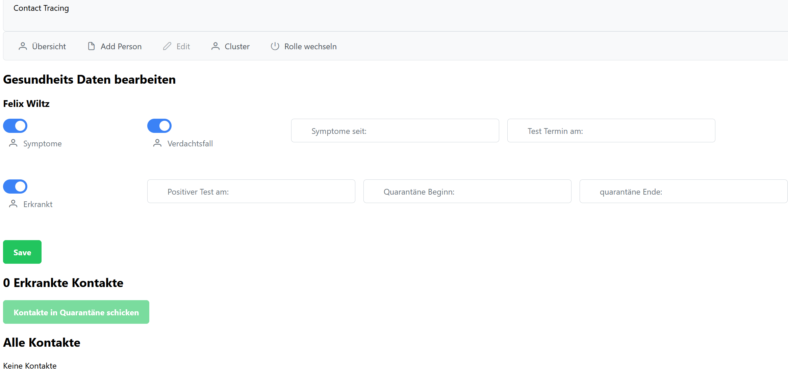
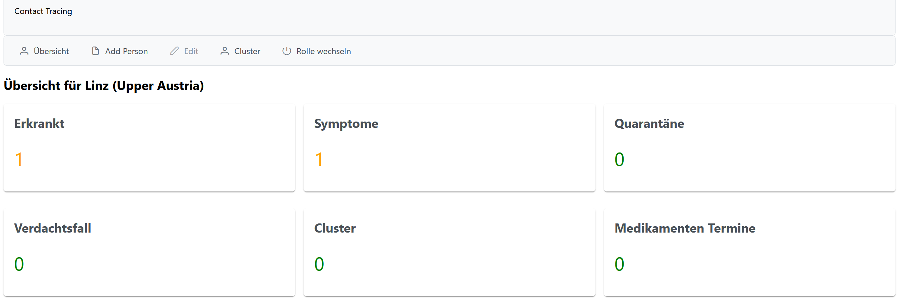

# Documentation

## Agenda
Überblick über die Software und die Funktionern, welche diese erfüllt. 
- Funktionen, welche das System erfüllt
- Komponenten

Überblick über die benötigte Software sowie die Installation der Anwendung um diese auf dem eigenen Laptop lauffähig zu bekommen. 
- Software
- Installation

Verfügbare Schnittstellen
- REST Schnittstellen


## Funktionen 

### Contact Tracing
Als Contact-Tracer (CT) ist es meine Aufgabe, im Rahmen des Contact-Tracings Personen zu verwalten, 
Cluster zu erkennen und Tests zuzuweisen. Dazu erfasse ich die relevanten Informationen von erkrankten 
Personen sowie deren Kontaktpersonen und weise ihnen einen Quarantäne-Zeitraum zu. Durch die Verwaltung 
der Personen und die Analyse von Kontakten kann ich Cluster identifizieren, bei denen mehrere erkrankte 
Personen involviert sind. 

- **Als CT erfasse ich eine Person mit Vorname, Nachname, Geburtsdatum, Sozialversicherungsnummer, Adresse (inkl. Bezirk) und Kontakt-Informationen.**
Die erste User Story befasst sich mit der Erfassung von Personen und deren relevanten 
- Informationen wie Vorname, Nachname, Geburtsdatum, Sozialversicherungsnummer, 
- Adresse (einschließlich Bezirk) und Kontaktdaten.

- **Als CT halte ich fest, ob die Person selbst erkrankt ist, Symptome hat und somit ein Verdachtsfall ist oder der Kontakt einer bereits erkrankten Person ist, aber selbst keine Symptome hat.**
Diese User Story beinhaltet das Festhalten des Krankheitsstatus einer Person. Es wird 
- unterschieden, ob die Person selbst erkrankt ist und Symptome hat (Verdachtsfall) 
- oder ob sie lediglich Kontakt zu einer erkrankten Person hatte, aber selbst keine Symptome zeigt.

- **Als CT weise ich erkrankten Personen und ihren Kontakten einen Quarantäne-Zeitraum zu.**
In dieser User Story wird festgehalten, dass erkrankten Personen und ihren Kontakten ein 
- Quarantäne-Zeitraum zugewiesen wird. Dadurch soll die Ausbreitung von Krankheiten eingedämmt werden.

- **Als CT muss ich eine bereits erfasste Person suchen können, um den Krankheitsstatus aktualisieren zu können.**
Diese User Story umfasst die Funktion, eine bereits erfasste Person im System zu suchen. 
- Dadurch kann der Krankheitsstatus der Person aktualisiert werden.

- **Als CT lege ich einen Cluster an, sobald eine erkrankte Person zwei Kontakte hat, die ebenfalls erkrankt sind.**
Hierbei geht es darum, dass ein Cluster angelegt wird, sobald eine erkrankte Person mindestens zwei 
- Kontakte hat, die ebenfalls erkrankt sind. Dies hilft bei der Identifikation von Ausbruchsherden 
- und ermöglicht gezielte Maßnahmen.

- **Als CT weise ich Verdachtsfällen einen Testtermin zu.**
In dieser User Story wird beschrieben, dass Verdachtsfällen ein Testtermin zugewiesen wird. Dadurch 
- können sie auf das Vorliegen einer Erkrankung überprüft werden.

- **Als CT erfasse ich das Datum eines positiven Tests.**
Diese User Story befasst sich mit der Erfassung des Datums eines positiven Tests. Dies ist wichtig,
- um den Verlauf der Erkrankung zu verfolgen und entsprechende Maßnahmen zu ergreifen.


### Bezirkshauptmann / Bezirkshauptfrau (BH) 
Als Bezirkshauptmann/Bezirkshauptfrau (BH) ist es von großer Bedeutung, den Überblick über 
die Gesundheitssituation im eigenen Bezirk zu behalten. Dazu benötige ich Informationen
darüber, wie viele Personen in meinem Bezirk erkrankt sind und ob es mögliche Cluster
gibt. Durch regelmäßige Updates vom Contact-Tracing-Team erhalte ich aktuelle Daten 
zu den erkrankten Personen und den identifizierten Clustern. Auf Basis dieser Informationen 
kann ich geeignete Maßnahmen ergreifen, um die Ausbreitung von Krankheiten einzudämmen und
die Gesundheit der Bürgerinnen und Bürger in meinem Bezirk zu schützen.

- **Als BH habe ich die aktuellen Zahlen visuell aufbereitet zur Verfügung. Wie viele Personen sind krank, Verdachtsfälle, in Quarantäne. Wie viele Cluster gibt es, wo und wie sind sie entstanden und wie viele Personen sind betroffen.**
Diese User Story befasst sich damit, dass der Bezirkshauptmann/Bezirkshauptfrau (BH) 
- Zugriff auf die aktuellen Zahlen der Gesundheitssituation im Bezirk hat. 
- Die Zahlen werden visuell aufbereitet präsentiert und umfassen Informationen 
- wie die Anzahl der erkrankten Personen, Verdachtsfälle, Personen in Quarantäne sowie 
- die Anzahl und Herkunft der Cluster. Durch diese visuelle Darstellung erhält 
- der BH einen schnellen Überblick über die aktuelle Lage.

- **Als BH weiß ich, wie viele Personen einen Termin für die Verabreichung eines Medikamentes gebucht haben.**
Diese User Story beschreibt, dass der BH Informationen darüber hat, wie viele Personen einen Termin
- für die Verabreichung eines Medikaments gebucht haben. Diese Informationen ermöglichen es dem BH, 
- die erforderlichen Ressourcen für die Medikamentenvergabe zu planen und sicherzustellen, 
- dass alle betroffenen Personen angemessen versorgt werden. Durch das Wissen um die Anzahl 
- der Termine kann der BH sicherstellen, dass die Verabreichung der Medikamente gemäß dem 
- vorgesehenen Zeitplan erfolgt.

## Komponenten
Die Anwendung besteht aus einigen Komponenten, welche im Folgenden aufgelistet werden. 

### Menü Komponente 
Die Menü-Komponente ist eine Navigationsleiste mit den folgenden Eigenschaften:


**Übersicht**: Diese Option navigiert den Benutzer zur Übersichtsseite, auf der alle Personen aufgelistet sind. Dort kann der Benutzer Informationen über alle erfassten Personen einsehen.

**Add Person**: Durch Auswahl dieser Option gelangt der Benutzer zu einer Seite, auf der er eine neue Person hinzufügen kann. Dort können alle relevanten Informationen zur Person erfasst werden.

**Cluster**: Bei Auswahl dieser Option wird der Benutzer zu einer Seite weitergeleitet, auf der alle erkannten Cluster aufgelistet sind. Hier erhält der Benutzer Informationen darüber, wo und wie die Cluster entstanden sind und wie viele Personen davon betroffen sind.

**Rolle wechseln**: Diese Option führt den Benutzer zurück zur Login-Seite, auf der er zwischen den Rollen Bezirkshauptmann/Bezirkshauptfrau (BH) und Contact-Tracer (CT) wechseln kann. Durch diese Funktion kann der Benutzer je nach Bedarf zwischen den beiden Rollen wechseln, um entsprechende Aufgaben auszuführen.

Die Menü-Komponente stellt somit eine einfache und benutzerfreundliche Navigation bereit, die dem Benutzer ermöglicht, schnell zwischen verschiedenen Funktionen und Seiten innerhalb des Systems zu wechseln.

### Login Komponente 
Die Login-Komponente bietet folgende Funktionen:



**Auswahl zwischen den beiden Rollen CT und BH:** Der Benutzer hat die Möglichkeit, 
zwischen den beiden Rollen als Contact-Tracer (CT) und Bezirkshauptmann/Bezirkshauptfrau (BH) 
zu wählen. Diese Auswahl erfolgt während des Login-Prozesses und bestimmt die entsprechenden
Funktionen und Aufgaben, auf die der Benutzer zugreifen kann.

- **Auflistung der möglichen Funktionen/Tasks:** Beim Login wird dem Benutzer 
eine Übersicht über die möglichen Funktionen und Aufgaben angezeigt, die mit der 
ausgewählten Rolle verbunden sind. Dies kann eine Liste von Aufgaben wie das 
Verwalten von Personen, das Erstellen von Clustern, das Zuweisen von Quarantäne-Zeiträumen 
oder das Anzeigen von Statistiken. 
Die Auflistung hilft dem Benutzer, einen Überblick über die verfügbaren Funktionen 
zu erhalten und schnell auf die gewünschten Bereiche des Systems zuzugreifen.

- **Beim Einloggen als BH Auswahl von Bundesland und Bezirk:** Wenn der Benutzer sich als 
Bezirkshauptmann/Bezirkshauptfrau (BH) einloggt, wird ihm eine zusätzliche Auswahlmöglichkeit 
für das Bundesland und den Bezirk angeboten. Diese Auswahl ist wichtig, da der BH 
spezifische Informationen und Daten für seinen Bezirk benötigt, um seine Aufgaben 
und Verantwortlichkeiten optimal wahrnehmen zu können. Die Auswahl von 
Bundesland und Bezirk ermöglicht es dem System, die relevanten Daten für den BH 
bereitzustellen und die Navigation auf seine spezifischen Zuständigkeiten auszurichten.

Die Login-Komponente bildet somit den Einstiegspunkt in das System und ermöglicht es den Benutzern, sich mit ihrer Rolle anzumelden und auf die entsprechenden Funktionen und Daten zuzugreifen. Durch die klare Auswahl der Rolle und die Auflistung der verfügbaren Funktionen wird eine benutzerfreundliche und zielgerichtete Navigation im System gewährleistet.


### Personen Übersicht Komponente
Die Personen-Übersichts-Komponente bietet folgende Funktionen:



**Anzeigen einer Tabelle mit allen wesentlichen Informationen:** 
In dieser Komponente wird dem Benutzer eine Tabelle präsentiert, die alle 
wesentlichen Informationen zu den erfassten Personen enthält. 
Dazu gehören die Sozialversicherungsnummer (SVNR), Vorname, Nachname, Informationen darüber, 
ob die Person erkrankt ist, ob Symptome vorliegen und ob die Person in Quarantäne ist. 
Durch diese tabellarische Darstellung erhält der Benutzer einen schnellen Überblick 
über alle erfassten Personen und deren wichtigste Daten.

**Erfassen und Bearbeiten von Gesundheitsdaten:** Innerhalb der 
Personen-Übersichts-Komponente hat der Benutzer die Möglichkeit, 
Gesundheitsdaten einer bestimmten Person zu erfassen oder zu bearbeiten. 
Dies kann Informationen wie den aktuellen Krankheitsstatus, Kontakte, das Vorhandensein von Symptomen 
oder den Quarantäne-Zustand betreffen. Durch diese Funktion kann der Benutzer die 
Gesundheitsdaten einer Person aktualisieren und auf dem neuesten Stand halten.

**Löschen der Person:**  Falls erforderlich, kann der Benutzer eine Person 
aus der Übersicht löschen. Dies kann notwendig sein, wenn eine Person beispielsweise 
das System verlassen hat oder die Daten aus anderen Gründen nicht mehr relevant sind. 
Das Löschen einer Person entfernt alle zugehörigen Daten und Informationen aus der Datenbank.

**Bearbeiten der Person:** Falls sich die Informationen einer Person ändern, 
kann der Benutzer die entsprechenden Daten innerhalb der Übersicht bearbeiten. 
Dies ermöglicht es, beispielsweise den Namen, die Kontaktdaten oder andere 
wichtige Informationen einer Person anzupassen. Durch die Bearbeitungsfunktion 
kann der Benutzer sicherstellen, dass die Daten stets korrekt und aktuell sind.

Die Personen-Übersichts-Komponente bietet dem Benutzer eine zentrale Anlaufstelle, 
um alle relevanten Informationen zu den erfassten Personen einzusehen, Gesundheitsdaten 
zu erfassen und zu bearbeiten, Personen zu löschen und Informationen zu aktualisieren. 
Durch diese Funktionen wird eine effiziente Verwaltung und Aktualisierung der 
Personeninformationen im System ermöglicht.

### Add Person Komponente
Die Person Hinzufügen Komponente bietet folgende Funktionen:



**Kontakte zu einer Person hinzufügen:** Diese Funktion ermöglicht es dem Benutzer, 
Kontakte einer bestimmten Person hinzuzufügen. Die Kontakte können andere 
Personen sein, die mit der erfassten Person in Verbindung stehen, beispielsweise 
Familienmitglieder, Freunde oder Arbeitskollegen. Durch das Hinzufügen von 
Kontakten können mögliche Infektionsketten nachvollzogen und gegebenenfalls 
weitere Maßnahmen ergriffen werden.

**Allgemeine Daten hinzufügen:** In dieser Komponente kann der Benutzer allgemeine 
Daten einer Person eingeben. Dazu gehören die Sozialversicherungsnummer (SVNR), 
Vorname, Nachname, Geburtstag, E-Mail-Adresse und Telefonnummer. Diese Informationen 
dienen dazu, eine eindeutige Identifizierung der Person zu ermöglichen und die 
Kommunikation im Zusammenhang mit dem Contact-Tracing-Prozess zu erleichtern.

**Adressdaten hinzufügen:** Der Benutzer kann auch Adressdaten einer Person erfassen. 
Dazu gehören Straße, Hausnummer, Bundesland, Bezirk und Land. Diese Informationen sind 
wichtig, um den geografischen Standort der erfassten Person zu kennen und gegebenenfalls 
gezielte Maßnahmen in bestimmten Regionen ergreifen zu können.

Durch die Person Hinzufügen Komponente wird der Benutzer in die Lage versetzt, 
eine neue Person in das System einzuführen und alle relevanten Daten zu erfassen. 
Die Möglichkeit, Kontakte, allgemeine Daten und Adressdaten hinzuzufügen, ermöglicht 
eine umfassende Dokumentation und ein effektives Contact-Tracing-Verfahren.

### Gesundheitsdaten Komponente
Die Gesundheitsdaten-Komponente bietet folgende Funktionen:



**Symptom-Status setzen:** Der Benutzer kann den Symptom-Status einer Person 
auf "Ja" oder "Nein" setzen. Wenn Symptome vorliegen, wird der Benutzer auch 
das Datum angeben, seit wann die Symptome bestehen, sowie den Termin für den 
Test. Diese Informationen sind wichtig, um potenzielle Verdachtsfälle zu 
identifizieren und geeignete Maßnahmen einzuleiten.

**Verdachtsfall-Status setzen:** Der Benutzer kann den Verdachtsfall-Status 
einer Person auf "Ja" oder "Nein" setzen. Dies ermöglicht die Kennzeichnung 
einer Person als möglichen Verdachtsfall, selbst wenn keine Symptome vorliegen. 
Dies ist hilfreich, um Personen zu identifizieren, die möglicherweise Kontakt 
mit erkrankten Personen hatten und weitere Untersuchungen oder Tests erfordern.

**Erkrankt-Status setzen:** Der Benutzer kann den Erkrankt-Status einer Person 
auf "Ja" oder "Nein" setzen. Wenn eine Person als erkrankt markiert ist, kann 
der Benutzer auch das Datum angeben, an dem die Quarantäne beginnt und endet. 
Dies ermöglicht es, den Quarantäne-Zeitraum entsprechend festzulegen und die 
erforderlichen Maßnahmen zu ergreifen.

**Auflistung der Kontakte als Tabelle:** In dieser Komponente wird dem Benutzer 
eine Tabelle präsentiert, die alle Kontakte einer bestimmten Person auflistet. 
Dies ermöglicht es dem Benutzer, einen Überblick über die Kontakte zu haben und 
gegebenenfalls weitere Maßnahmen zu ergreifen, wie zum Beispiel das Senden der 
Kontakte in Quarantäne.

**Funktion zum Senden aller Kontakte in Quarantäne:** Der Benutzer kann mit einer 
Funktion alle Kontakte einer Person gleichzeitig in Quarantäne schicken. Diese 
Funktion erleichtert das Verwalten und Durchführen von Quarantäne-Maßnahmen für 
die Kontakte einer erkrankten Person.

**Erfassen eines positiven Tests:** Der Benutzer hat die Möglichkeit, einen 
positiven Test für eine Person zu erfassen. Dies ermöglicht es, den aktuellen 
Gesundheitszustand der Person zu dokumentieren und weitere Maßnahmen, wie zum 
Beispiel die Ermittlung von Kontaktpersonen, einzuleiten.

Die Gesundheitsdaten-Komponente bietet dem Benutzer eine zentrale Stelle, um alle 
relevanten Gesundheitsdaten einer Person zu erfassen und zu verwalten. Durch das 
Setzen von Symptom-, Verdachtsfall- und Erkrankt-Status sowie das Verwalten der 
Kontakte und das Erfassen eines positiven Tests wird eine effiziente und umfassende 
Erfassung und Verwaltung der Gesundheitsdaten ermöglicht.

### BH Komponente
Die BH-Komponente bietet folgende Funktionen:



**Visualisierung der Anzahl erkrankter Personen:** In dieser Komponente wird dem 
Bezirkshauptmann/der Bezirkshauptfrau eine visuelle Darstellung präsentiert, 
die die Anzahl der erkrankten Personen im Bezirk zeigt.

**Visualisierung der Anzahl von Personen mit Symptomen:** Der BH kann in dieser Komponente 
die Anzahl der Personen mit Symptomen im Bezirk visualisieren.

**Visualisierung der Anzahl von Personen in Quarantäne:** Die BH-Komponente zeigt dem 
Bezirkshauptmann/der Bezirkshauptfrau auch die Anzahl der Personen an, 
die sich derzeit in Quarantäne befinden. 

**Visualisierung der Anzahl von Verdachtsfällen:** Der BH kann in dieser Komponente 
die Anzahl der Verdachtsfälle im Bezirk visualisieren. 

**Visualisierung der Anzahl von Clustern:** Die BH-Komponente bietet dem 
Bezirkshauptmann/der Bezirkshauptfrau auch eine visuelle Darstellung der Anzahl von 
Clustern im Bezirk. 

**Visualisierung der Anzahl von Medikamenten-Buchungsterminen:** In dieser Komponente 
kann der BH die Anzahl der gebuchten Termine für die Verabreichung von 
Medikamenten im Bezirk visualisieren. 

Die BH-Komponente bietet dem Bezirkshauptmann/der Bezirkshauptfrau eine umfassende 
Visualisierung der wichtigsten statistischen Informationen über den Bezirk, 
einschließlich der Anzahl erkrankter Personen, Personen mit Symptomen, Personen in 
Quarantäne, Verdachtsfälle, Cluster und gebuchter Medikamenten-Buchungstermine. 


## Software
Die nachfolgende Software wird benötigt, um das Projekt lokal auf dem eigenen Rechner aufzusetzen
und lauffähig zu machen. 

### Git
GIT ist ein verteiltes Versionskontrollsystem, das entwickelt wurde, 
um Änderungen in Dateien und Projekten zu verfolgen, zu verwalten und zu 
synchronisieren, insbesondere bei der Zusammenarbeit von Entwicklern an Softwareprojekten.

Link zur Installation:
https://git-scm.com/

### Node JS
Node.js ist eine serverseitige Laufzeitumgebung, die auf der 
JavaScript-Plattform aufbaut und es Entwicklern ermöglicht, 
JavaScript-Code außerhalb eines Webbrowsers auszuführen, 
um skalierbare und effiziente Netzwerkanwendungen zu erstellen.

Link zur Installation:
https://nodejs.org/en

### Java
Java ist eine objektorientierte Programmiersprache, die entwickelt 
wurde, um plattformunabhängige Anwendungen zu erstellen. Sie 
ermöglicht die Entwicklung von robusten und sicheren Softwarelösungen 
für eine Vielzahl von Anwendungsdomänen.

Link zur Installation:
https://www.java.com/de/download/manual.jsp

### IntelliJ
IntelliJ IDEA ist eine integrierte Entwicklungsumgebung (IDE) für 
Softwareentwicklung, die eine Vielzahl von Tools und Funktionen bietet, 
um Entwicklern bei der effizienten Erstellung, Bearbeitung und Debugging 
von Code in verschiedenen Programmiersprachen wie Java und Kotlin zu unterstützen.

Link zur Installation:
https://www.jetbrains.com/de-de/idea/

### Postman
Postman ermöglicht es APIs zu testen, zu dokumentieren und zu verwalten. Mit Postman 
können HTTP-Anfragen gesendet, Antworten überprüft und verschiedene 
API-Szenarien simuliert werden.

Link zur Installation:
https://www.postman.com/


### MariaDB
MariaDB ist ein relationales Datenbankverwaltungssystem (RDBMS), 
das auf der Open-Source-Version von MySQL basiert. Es bietet eine 
zuverlässige, leistungsstarke und skalierbare Datenbanklösung für 
die Speicherung und Verwaltung von Daten in verschiedenen Anwendungen und Umgebungen.

Link zur Installation:
https://mariadb.org/

### MySQL Workbench
MySQL Workbench ist eine grafische integrierte Entwicklungsumgebung (IDE) 
für die Verwaltung von MySQL-Datenbanken. Es bietet Tools zum Entwerfen 
von Datenbanken, zum Erstellen und Ausführen von SQL-Abfragen, zum 
Datenbankmonitoring und zur Verwaltung von Verbindungen, Tabellen und Benutzern.

Link zur Installation:
https://www.mysql.com/products/workbench/

### Docker Desktop
Docker ist eine Open-Source-Plattform, die es ermöglicht, Anwendungen und 
deren Abhängigkeiten in isolierten Containern zu verpacken und auszuführen. 
Dadurch wird eine konsistente Bereitstellung von Anwendungen über 
verschiedene Umgebungen hinweg erleichtert und die Skalierbarkeit und 
Portabilität von Anwendungen verbessert.

Link zur Installation:
https://www.docker.com/products/docker-desktop/

## Installation
Hier sind überblicksmäßig alle erforderlichen Schritte aufgelistet, welche notwendig 
sind um die Applikation lokal aufzusetzen. 

### Git clone
Zuerst muss das Git Repository ge-cloned werden: \
https://github.com/manuelwiltz/pr-dke-contact-tracing

git clone \
```git@github.com:manuelwiltz/pr-dke-contact-tracing.git```

### Angular Development server

Navigiere vom Projektverzeichnis in das frontend Verzeichnis. \
Starte `ng serve` in der Command Line für den dev server. \
Navigiere zu `http://localhost:4200/`. \
Die Anwendung lädt automatisch neu, wenn Änderungen im Angular Projekt durchgeführt werden.

### Datenbank
Einloggen in MariaDB mit dem zuvor festgelegten Username und Passwort. \
Anschließend die Datenbank erstellen, um diese anschließend im Backend verwenden zu können. \
``create database contactTracing;`` \
``use contactTracing;``

Stelle sicher, dass der Port 3306 lokal nicht verwendet wird, sonst kann der Docker Container
nicht gestartet werden. \
Führe anschließend den Befehl ``docker-compose up`` im Root Level des Projekverzeichnisses aus
um den docker Container für die MariaDB Datenbank zu starten.

### Backend
Öffne das Backend Projekt in IntelliJ und führe die Standard Konfiguration im Main File aus. 


## REST Schnittstellen
Hier sind alle verfügbaren REST Schnittstellen aufgeführt:

  <h1>OpenAPI definition</h1>
    <div class="app-desc">No description provided (generated by Swagger Codegen https://github.com/swagger-api/swagger-codegen)</div>
    <div class="app-desc">More information: <a href="https://helloreverb.com">https://helloreverb.com</a></div>
    <div class="app-desc">Contact Info: <a href="hello@helloreverb.com">hello@helloreverb.com</a></div>
    <div class="app-desc">Version: v0</div>

    <div class="license-info">All rights reserved</div>
    <div class="license-url">http://apache.org/licenses/LICENSE-2.0.html</div>
<h2>Access</h2>

<h2><a name="__Methods">Methods</a></h2>
[ Jump to <a href="#__Models">Models</a> ]

<h3>Table of Contents </h3>
  <div class="method-summary"></div>
  <h4><a href="#PersonAPI">PersonAPI</a></h4>
  <ul>
  <li><a href="#addPerson"><code><span class="http-method">post</span> /person</code></a></li>
  <li><a href="#deletePerson"><code><span class="http-method">delete</span> /person/{svnr}</code></a></li>
  <li><a href="#getAllPerson"><code><span class="http-method">get</span> /person</code></a></li>
  <li><a href="#getContactsFromPerson"><code><span class="http-method">get</span> /person/{svnr}/contacts</code></a></li>
  <li><a href="#getPeopleByStateAndCounty"><code><span class="http-method">get</span> /persons/{state}/{county}</code></a></li>
  <li><a href="#getPeopleLength"><code><span class="http-method">get</span> /persons/length</code></a></li>
  <li><a href="#getPersonBySvnr"><code><span class="http-method">get</span> /person/{svnr}</code></a></li>
  <li><a href="#getPersonsBySvnr"><code><span class="http-method">put</span> /persons/</code></a></li>
  <li><a href="#getSickInformationFromPerson"><code><span class="http-method">get</span> /person/{svnr}/sickinformation</code></a></li>
  <li><a href="#getTotalAmountOfPeopleByStateAndCounty"><code><span class="http-method">get</span> /persons/length/{state}/{county}</code></a></li>
  <li><a href="#updatePerson"><code><span class="http-method">put</span> /person/{svnr}</code></a></li>
  <li><a href="#updateSickInformationFromPerson"><code><span class="http-method">put</span> /person/{svnr}/sickinformation</code></a></li>
  </ul>

  <h1><a name="PersonAPI">PersonAPI</a></h1>
  <div class="method"><a name="addPerson"></a>
    <div class="method-path">
    <a class="up" href="#__Methods">Up</a>
    <pre class="post"><code class="huge"><span class="http-method">post</span> /person</code></pre></div>
    <div class="method-summary">Create a person. (<span class="nickname">addPerson</span>)</div>
    <div class="method-notes">Creates and returns a person.</div>


    <h3 class="field-label">Consumes</h3>
    This API call consumes the following media types via the <span class="header">Content-Type</span> request header:
    <ul>
      <li><code>application/json</code></li>
    </ul>

    <h3 class="field-label">Request body</h3>
    <div class="field-items">
      <div class="param">body <a href="#Person">Person</a> (required)</div>
      
            <div class="param-desc"><span class="param-type">Body Parameter</span> &mdash;  </div>
                </div>  <!-- field-items -->


    <h3 class="field-label">Return type</h3>
    <div class="return-type">
      <a href="#Person">Person</a>
      
    </div>

    <!--Todo: process Response Object and its headers, schema, examples -->

    <h3 class="field-label">Example data</h3>
    <div class="example-data-content-type">Content-Type: application/json</div>
    <pre class="example"><code>{
"birthday" : "2000-01-23T04:56:07.000+00:00",
"svnr" : 6,
"firstName" : "firstName",
"lastName" : "lastName",
"address" : {
"country" : "country",
"streetName" : "streetName",
"doorNumber" : "doorNumber",
"county" : "county",
"id" : 1,
"state" : "state"
},
"phoneNumber" : "phoneNumber",
"sickInformation" : {
"symptoms" : true,
"quarantineEndDate" : "2000-01-23T04:56:07.000+00:00",
"symptomStartingDate" : "2000-01-23T04:56:07.000+00:00",
"covidTestDate" : "2000-01-23T04:56:07.000+00:00",
"quarantine" : true,
"id" : 5,
"sick" : true,
"medicationDate" : "2000-01-23T04:56:07.000+00:00",
"quarantineStartDate" : "2000-01-23T04:56:07.000+00:00"
},
"id" : 0,
"email" : "email",
"contacts" : [ "contacts", "contacts" ]
}</code></pre>

    <h3 class="field-label">Produces</h3>
    This API call produces the following media types according to the <span class="header">Accept</span> request header;
    the media type will be conveyed by the <span class="header">Content-Type</span> response header.
    <ul>
      <li><code>*/*</code></li>
    </ul>

    <h3 class="field-label">Responses</h3>
    <h4 class="field-label">200</h4>
    OK
        <a href="#Person">Person</a>
  </div> <!-- method -->
  <hr/>
  <div class="method"><a name="deletePerson"></a>
    <div class="method-path">
    <a class="up" href="#__Methods">Up</a>
    <pre class="delete"><code class="huge"><span class="http-method">delete</span> /person/{svnr}</code></pre></div>
    <div class="method-summary">Delete a person. (<span class="nickname">deletePerson</span>)</div>
    <div class="method-notes">Deletes and returns the person.</div>

    <h3 class="field-label">Path parameters</h3>
    <div class="field-items">
      <div class="param">svnr (required)</div>
      
            <div class="param-desc"><span class="param-type">Path Parameter</span> &mdash; Unique social security number format: int32</div>    </div>  <!-- field-items -->


    <!--Todo: process Response Object and its headers, schema, examples -->


    <h3 class="field-label">Responses</h3>
    <h4 class="field-label">200</h4>
    OK
        <a href="#"></a>
  </div> <!-- method -->
  <hr/>
  <div class="method"><a name="getAllPerson"></a>
    <div class="method-path">
    <a class="up" href="#__Methods">Up</a>
    <pre class="get"><code class="huge"><span class="http-method">get</span> /person</code></pre></div>
    <div class="method-summary">Get a list of all persons. (<span class="nickname">getAllPerson</span>)</div>
    <div class="method-notes">Returns a list of all persons.</div>


    <h3 class="field-label">Return type</h3>
    <div class="return-type">
      array[<a href="#Person">Person</a>]
      
    </div>

    <!--Todo: process Response Object and its headers, schema, examples -->

    <h3 class="field-label">Example data</h3>
    <div class="example-data-content-type">Content-Type: application/json</div>
    <pre class="example"><code>[ {
"birthday" : "2000-01-23T04:56:07.000+00:00",
"svnr" : 6,
"firstName" : "firstName",
"lastName" : "lastName",
"address" : {
"country" : "country",
"streetName" : "streetName",
"doorNumber" : "doorNumber",
"county" : "county",
"id" : 1,
"state" : "state"
},
"phoneNumber" : "phoneNumber",
"sickInformation" : {
"symptoms" : true,
"quarantineEndDate" : "2000-01-23T04:56:07.000+00:00",
"symptomStartingDate" : "2000-01-23T04:56:07.000+00:00",
"covidTestDate" : "2000-01-23T04:56:07.000+00:00",
"quarantine" : true,
"id" : 5,
"sick" : true,
"medicationDate" : "2000-01-23T04:56:07.000+00:00",
"quarantineStartDate" : "2000-01-23T04:56:07.000+00:00"
},
"id" : 0,
"email" : "email",
"contacts" : [ "contacts", "contacts" ]
}, {
"birthday" : "2000-01-23T04:56:07.000+00:00",
"svnr" : 6,
"firstName" : "firstName",
"lastName" : "lastName",
"address" : {
"country" : "country",
"streetName" : "streetName",
"doorNumber" : "doorNumber",
"county" : "county",
"id" : 1,
"state" : "state"
},
"phoneNumber" : "phoneNumber",
"sickInformation" : {
"symptoms" : true,
"quarantineEndDate" : "2000-01-23T04:56:07.000+00:00",
"symptomStartingDate" : "2000-01-23T04:56:07.000+00:00",
"covidTestDate" : "2000-01-23T04:56:07.000+00:00",
"quarantine" : true,
"id" : 5,
"sick" : true,
"medicationDate" : "2000-01-23T04:56:07.000+00:00",
"quarantineStartDate" : "2000-01-23T04:56:07.000+00:00"
},
"id" : 0,
"email" : "email",
"contacts" : [ "contacts", "contacts" ]
} ]</code></pre>

    <h3 class="field-label">Produces</h3>
    This API call produces the following media types according to the <span class="header">Accept</span> request header;
    the media type will be conveyed by the <span class="header">Content-Type</span> response header.
    <ul>
      <li><code>*/*</code></li>
    </ul>

    <h3 class="field-label">Responses</h3>
    <h4 class="field-label">200</h4>
    OK

  </div> <!-- method -->
  <hr/>
  <div class="method"><a name="getContactsFromPerson"></a>
    <div class="method-path">
    <a class="up" href="#__Methods">Up</a>
    <pre class="get"><code class="huge"><span class="http-method">get</span> /person/{svnr}/contacts</code></pre></div>
    <div class="method-summary">Get the contacts of a person. (<span class="nickname">getContactsFromPerson</span>)</div>
    <div class="method-notes">Returns a list of social security numbers to identify their contacts.</div>

    <h3 class="field-label">Path parameters</h3>
    <div class="field-items">
      <div class="param">svnr (required)</div>
      
            <div class="param-desc"><span class="param-type">Path Parameter</span> &mdash; Unique social security number format: int32</div>    </div>  <!-- field-items -->


    <h3 class="field-label">Return type</h3>
    <div class="return-type">
      
      array[String]
    </div>

    <!--Todo: process Response Object and its headers, schema, examples -->

    <h3 class="field-label">Example data</h3>
    <div class="example-data-content-type">Content-Type: application/json</div>
    <pre class="example"><code>[ "", "" ]</code></pre>

    <h3 class="field-label">Produces</h3>
    This API call produces the following media types according to the <span class="header">Accept</span> request header;
    the media type will be conveyed by the <span class="header">Content-Type</span> response header.
    <ul>
      <li><code>*/*</code></li>
    </ul>

    <h3 class="field-label">Responses</h3>
    <h4 class="field-label">200</h4>
    OK

  </div> <!-- method -->
  <hr/>
  <div class="method"><a name="getPeopleByStateAndCounty"></a>
    <div class="method-path">
    <a class="up" href="#__Methods">Up</a>
    <pre class="get"><code class="huge"><span class="http-method">get</span> /persons/{state}/{county}</code></pre></div>
    <div class="method-summary">Get list of people by state and county. (<span class="nickname">getPeopleByStateAndCounty</span>)</div>
    <div class="method-notes">Returns a list of people by state and county.</div>

    <h3 class="field-label">Path parameters</h3>
    <div class="field-items">
      <div class="param">state (required)</div>
      
            <div class="param-desc"><span class="param-type">Path Parameter</span> &mdash; State (Bundesland) </div>      <div class="param">county (required)</div>
      
            <div class="param-desc"><span class="param-type">Path Parameter</span> &mdash; County (Bezirk) </div>    </div>  <!-- field-items -->


    <h3 class="field-label">Return type</h3>
    <div class="return-type">
      array[<a href="#Person">Person</a>]
      
    </div>

    <!--Todo: process Response Object and its headers, schema, examples -->

    <h3 class="field-label">Example data</h3>
    <div class="example-data-content-type">Content-Type: application/json</div>
    <pre class="example"><code>[ {
"birthday" : "2000-01-23T04:56:07.000+00:00",
"svnr" : 6,
"firstName" : "firstName",
"lastName" : "lastName",
"address" : {
"country" : "country",
"streetName" : "streetName",
"doorNumber" : "doorNumber",
"county" : "county",
"id" : 1,
"state" : "state"
},
"phoneNumber" : "phoneNumber",
"sickInformation" : {
"symptoms" : true,
"quarantineEndDate" : "2000-01-23T04:56:07.000+00:00",
"symptomStartingDate" : "2000-01-23T04:56:07.000+00:00",
"covidTestDate" : "2000-01-23T04:56:07.000+00:00",
"quarantine" : true,
"id" : 5,
"sick" : true,
"medicationDate" : "2000-01-23T04:56:07.000+00:00",
"quarantineStartDate" : "2000-01-23T04:56:07.000+00:00"
},
"id" : 0,
"email" : "email",
"contacts" : [ "contacts", "contacts" ]
}, {
"birthday" : "2000-01-23T04:56:07.000+00:00",
"svnr" : 6,
"firstName" : "firstName",
"lastName" : "lastName",
"address" : {
"country" : "country",
"streetName" : "streetName",
"doorNumber" : "doorNumber",
"county" : "county",
"id" : 1,
"state" : "state"
},
"phoneNumber" : "phoneNumber",
"sickInformation" : {
"symptoms" : true,
"quarantineEndDate" : "2000-01-23T04:56:07.000+00:00",
"symptomStartingDate" : "2000-01-23T04:56:07.000+00:00",
"covidTestDate" : "2000-01-23T04:56:07.000+00:00",
"quarantine" : true,
"id" : 5,
"sick" : true,
"medicationDate" : "2000-01-23T04:56:07.000+00:00",
"quarantineStartDate" : "2000-01-23T04:56:07.000+00:00"
},
"id" : 0,
"email" : "email",
"contacts" : [ "contacts", "contacts" ]
} ]</code></pre>

    <h3 class="field-label">Produces</h3>
    This API call produces the following media types according to the <span class="header">Accept</span> request header;
    the media type will be conveyed by the <span class="header">Content-Type</span> response header.
    <ul>
      <li><code>*/*</code></li>
    </ul>

    <h3 class="field-label">Responses</h3>
    <h4 class="field-label">200</h4>
    OK

  </div> <!-- method -->
  <hr/>
  <div class="method"><a name="getPeopleLength"></a>
    <div class="method-path">
    <a class="up" href="#__Methods">Up</a>
    <pre class="get"><code class="huge"><span class="http-method">get</span> /persons/length</code></pre></div>
    <div class="method-summary">Get the total count of people. (<span class="nickname">getPeopleLength</span>)</div>
    <div class="method-notes">Returns a number containing the sum of all people.</div>


    <h3 class="field-label">Return type</h3>
    <div class="return-type">
      
      Integer
    </div>

    <!--Todo: process Response Object and its headers, schema, examples -->

    <h3 class="field-label">Example data</h3>
    <div class="example-data-content-type">Content-Type: application/json</div>
    <pre class="example"><code>0</code></pre>

    <h3 class="field-label">Produces</h3>
    This API call produces the following media types according to the <span class="header">Accept</span> request header;
    the media type will be conveyed by the <span class="header">Content-Type</span> response header.
    <ul>
      <li><code>*/*</code></li>
    </ul>

    <h3 class="field-label">Responses</h3>
    <h4 class="field-label">200</h4>
    OK
        <a href="#Integer">Integer</a>
  </div> <!-- method -->
  <hr/>
  <div class="method"><a name="getPersonBySvnr"></a>
    <div class="method-path">
    <a class="up" href="#__Methods">Up</a>
    <pre class="get"><code class="huge"><span class="http-method">get</span> /person/{svnr}</code></pre></div>
    <div class="method-summary">Get a person by their social security number. (<span class="nickname">getPersonBySvnr</span>)</div>
    <div class="method-notes">Returns a person by their social security number.</div>

    <h3 class="field-label">Path parameters</h3>
    <div class="field-items">
      <div class="param">svnr (required)</div>
      
            <div class="param-desc"><span class="param-type">Path Parameter</span> &mdash; Unique social security number format: int32</div>    </div>  <!-- field-items -->


    <h3 class="field-label">Return type</h3>
    <div class="return-type">
      <a href="#Person">Person</a>
      
    </div>

    <!--Todo: process Response Object and its headers, schema, examples -->

    <h3 class="field-label">Example data</h3>
    <div class="example-data-content-type">Content-Type: application/json</div>
    <pre class="example"><code>{
"birthday" : "2000-01-23T04:56:07.000+00:00",
"svnr" : 6,
"firstName" : "firstName",
"lastName" : "lastName",
"address" : {
"country" : "country",
"streetName" : "streetName",
"doorNumber" : "doorNumber",
"county" : "county",
"id" : 1,
"state" : "state"
},
"phoneNumber" : "phoneNumber",
"sickInformation" : {
"symptoms" : true,
"quarantineEndDate" : "2000-01-23T04:56:07.000+00:00",
"symptomStartingDate" : "2000-01-23T04:56:07.000+00:00",
"covidTestDate" : "2000-01-23T04:56:07.000+00:00",
"quarantine" : true,
"id" : 5,
"sick" : true,
"medicationDate" : "2000-01-23T04:56:07.000+00:00",
"quarantineStartDate" : "2000-01-23T04:56:07.000+00:00"
},
"id" : 0,
"email" : "email",
"contacts" : [ "contacts", "contacts" ]
}</code></pre>

    <h3 class="field-label">Produces</h3>
    This API call produces the following media types according to the <span class="header">Accept</span> request header;
    the media type will be conveyed by the <span class="header">Content-Type</span> response header.
    <ul>
      <li><code>*/*</code></li>
    </ul>

    <h3 class="field-label">Responses</h3>
    <h4 class="field-label">200</h4>
    OK
        <a href="#Person">Person</a>
  </div> <!-- method -->
  <hr/>
  <div class="method"><a name="getPersonsBySvnr"></a>
    <div class="method-path">
    <a class="up" href="#__Methods">Up</a>
    <pre class="put"><code class="huge"><span class="http-method">put</span> /persons/</code></pre></div>
    <div class="method-summary">Get a list of persons by their social security numbers. (<span class="nickname">getPersonsBySvnr</span>)</div>
    <div class="method-notes">Returns a list persons by their social security numbers.</div>


    <h3 class="field-label">Consumes</h3>
    This API call consumes the following media types via the <span class="header">Content-Type</span> request header:
    <ul>
      <li><code>application/json</code></li>
    </ul>

    <h3 class="field-label">Request body</h3>
    <div class="field-items">
      <div class="param">body <a href="#integer">integer</a> (required)</div>
      
            <div class="param-desc"><span class="param-type">Body Parameter</span> &mdash;  </div>
                </div>  <!-- field-items -->


    <h3 class="field-label">Return type</h3>
    <div class="return-type">
      array[<a href="#Person">Person</a>]
      
    </div>

    <!--Todo: process Response Object and its headers, schema, examples -->

    <h3 class="field-label">Example data</h3>
    <div class="example-data-content-type">Content-Type: application/json</div>
    <pre class="example"><code>[ {
"birthday" : "2000-01-23T04:56:07.000+00:00",
"svnr" : 6,
"firstName" : "firstName",
"lastName" : "lastName",
"address" : {
"country" : "country",
"streetName" : "streetName",
"doorNumber" : "doorNumber",
"county" : "county",
"id" : 1,
"state" : "state"
},
"phoneNumber" : "phoneNumber",
"sickInformation" : {
"symptoms" : true,
"quarantineEndDate" : "2000-01-23T04:56:07.000+00:00",
"symptomStartingDate" : "2000-01-23T04:56:07.000+00:00",
"covidTestDate" : "2000-01-23T04:56:07.000+00:00",
"quarantine" : true,
"id" : 5,
"sick" : true,
"medicationDate" : "2000-01-23T04:56:07.000+00:00",
"quarantineStartDate" : "2000-01-23T04:56:07.000+00:00"
},
"id" : 0,
"email" : "email",
"contacts" : [ "contacts", "contacts" ]
}, {
"birthday" : "2000-01-23T04:56:07.000+00:00",
"svnr" : 6,
"firstName" : "firstName",
"lastName" : "lastName",
"address" : {
"country" : "country",
"streetName" : "streetName",
"doorNumber" : "doorNumber",
"county" : "county",
"id" : 1,
"state" : "state"
},
"phoneNumber" : "phoneNumber",
"sickInformation" : {
"symptoms" : true,
"quarantineEndDate" : "2000-01-23T04:56:07.000+00:00",
"symptomStartingDate" : "2000-01-23T04:56:07.000+00:00",
"covidTestDate" : "2000-01-23T04:56:07.000+00:00",
"quarantine" : true,
"id" : 5,
"sick" : true,
"medicationDate" : "2000-01-23T04:56:07.000+00:00",
"quarantineStartDate" : "2000-01-23T04:56:07.000+00:00"
},
"id" : 0,
"email" : "email",
"contacts" : [ "contacts", "contacts" ]
} ]</code></pre>

    <h3 class="field-label">Produces</h3>
    This API call produces the following media types according to the <span class="header">Accept</span> request header;
    the media type will be conveyed by the <span class="header">Content-Type</span> response header.
    <ul>
      <li><code>*/*</code></li>
    </ul>

    <h3 class="field-label">Responses</h3>
    <h4 class="field-label">200</h4>
    OK

  </div> <!-- method -->
  <hr/>
  <div class="method"><a name="getSickInformationFromPerson"></a>
    <div class="method-path">
    <a class="up" href="#__Methods">Up</a>
    <pre class="get"><code class="huge"><span class="http-method">get</span> /person/{svnr}/sickinformation</code></pre></div>
    <div class="method-summary">Get the sick information of a person. (<span class="nickname">getSickInformationFromPerson</span>)</div>
    <div class="method-notes">Returns the sick information of a person.</div>

    <h3 class="field-label">Path parameters</h3>
    <div class="field-items">
      <div class="param">svnr (required)</div>
      
            <div class="param-desc"><span class="param-type">Path Parameter</span> &mdash; Unique social security number format: int32</div>    </div>  <!-- field-items -->


    <h3 class="field-label">Return type</h3>
    <div class="return-type">
      <a href="#SickInformation">SickInformation</a>
      
    </div>

    <!--Todo: process Response Object and its headers, schema, examples -->

    <h3 class="field-label">Example data</h3>
    <div class="example-data-content-type">Content-Type: application/json</div>
    <pre class="example"><code>{
"symptoms" : true,
"quarantineEndDate" : "2000-01-23T04:56:07.000+00:00",
"symptomStartingDate" : "2000-01-23T04:56:07.000+00:00",
"covidTestDate" : "2000-01-23T04:56:07.000+00:00",
"quarantine" : true,
"id" : 5,
"sick" : true,
"medicationDate" : "2000-01-23T04:56:07.000+00:00",
"quarantineStartDate" : "2000-01-23T04:56:07.000+00:00"
}</code></pre>

    <h3 class="field-label">Produces</h3>
    This API call produces the following media types according to the <span class="header">Accept</span> request header;
    the media type will be conveyed by the <span class="header">Content-Type</span> response header.
    <ul>
      <li><code>*/*</code></li>
    </ul>

    <h3 class="field-label">Responses</h3>
    <h4 class="field-label">200</h4>
    OK
        <a href="#SickInformation">SickInformation</a>
  </div> <!-- method -->
  <hr/>
  <div class="method"><a name="getTotalAmountOfPeopleByStateAndCounty"></a>
    <div class="method-path">
    <a class="up" href="#__Methods">Up</a>
    <pre class="get"><code class="huge"><span class="http-method">get</span> /persons/length/{state}/{county}</code></pre></div>
    <div class="method-summary">Get list of people by state and county. (<span class="nickname">getTotalAmountOfPeopleByStateAndCounty</span>)</div>
    <div class="method-notes">Returns a list of people by state and county.</div>

    <h3 class="field-label">Path parameters</h3>
    <div class="field-items">
      <div class="param">state (required)</div>
      
            <div class="param-desc"><span class="param-type">Path Parameter</span> &mdash; State (Bundesland) </div>      <div class="param">county (required)</div>
      
            <div class="param-desc"><span class="param-type">Path Parameter</span> &mdash; County (Bezirk) </div>    </div>  <!-- field-items -->


    <h3 class="field-label">Return type</h3>
    <div class="return-type">
      
      Integer
    </div>

    <!--Todo: process Response Object and its headers, schema, examples -->

    <h3 class="field-label">Example data</h3>
    <div class="example-data-content-type">Content-Type: application/json</div>
    <pre class="example"><code>0</code></pre>

    <h3 class="field-label">Produces</h3>
    This API call produces the following media types according to the <span class="header">Accept</span> request header;
    the media type will be conveyed by the <span class="header">Content-Type</span> response header.
    <ul>
      <li><code>*/*</code></li>
    </ul>

    <h3 class="field-label">Responses</h3>
    <h4 class="field-label">200</h4>
    OK
        <a href="#Integer">Integer</a>
  </div> <!-- method -->
  <hr/>
  <div class="method"><a name="updatePerson"></a>
    <div class="method-path">
    <a class="up" href="#__Methods">Up</a>
    <pre class="put"><code class="huge"><span class="http-method">put</span> /person/{svnr}</code></pre></div>
    <div class="method-summary">Update a person. (<span class="nickname">updatePerson</span>)</div>
    <div class="method-notes">Updates and returns the person.</div>

    <h3 class="field-label">Path parameters</h3>
    <div class="field-items">
      <div class="param">svnr (required)</div>
      
            <div class="param-desc"><span class="param-type">Path Parameter</span> &mdash; Unique social security number format: int32</div>    </div>  <!-- field-items -->

    <h3 class="field-label">Consumes</h3>
    This API call consumes the following media types via the <span class="header">Content-Type</span> request header:
    <ul>
      <li><code>application/json</code></li>
    </ul>

    <h3 class="field-label">Request body</h3>
    <div class="field-items">
      <div class="param">body <a href="#Person">Person</a> (required)</div>
      
            <div class="param-desc"><span class="param-type">Body Parameter</span> &mdash;  </div>
                </div>  <!-- field-items -->


    <h3 class="field-label">Return type</h3>
    <div class="return-type">
      <a href="#Person">Person</a>
      
    </div>

    <!--Todo: process Response Object and its headers, schema, examples -->

    <h3 class="field-label">Example data</h3>
    <div class="example-data-content-type">Content-Type: application/json</div>
    <pre class="example"><code>{
"birthday" : "2000-01-23T04:56:07.000+00:00",
"svnr" : 6,
"firstName" : "firstName",
"lastName" : "lastName",
"address" : {
"country" : "country",
"streetName" : "streetName",
"doorNumber" : "doorNumber",
"county" : "county",
"id" : 1,
"state" : "state"
},
"phoneNumber" : "phoneNumber",
"sickInformation" : {
"symptoms" : true,
"quarantineEndDate" : "2000-01-23T04:56:07.000+00:00",
"symptomStartingDate" : "2000-01-23T04:56:07.000+00:00",
"covidTestDate" : "2000-01-23T04:56:07.000+00:00",
"quarantine" : true,
"id" : 5,
"sick" : true,
"medicationDate" : "2000-01-23T04:56:07.000+00:00",
"quarantineStartDate" : "2000-01-23T04:56:07.000+00:00"
},
"id" : 0,
"email" : "email",
"contacts" : [ "contacts", "contacts" ]
}</code></pre>

    <h3 class="field-label">Produces</h3>
    This API call produces the following media types according to the <span class="header">Accept</span> request header;
    the media type will be conveyed by the <span class="header">Content-Type</span> response header.
    <ul>
      <li><code>*/*</code></li>
    </ul>

    <h3 class="field-label">Responses</h3>
    <h4 class="field-label">200</h4>
    OK
        <a href="#Person">Person</a>
  </div> <!-- method -->
  <hr/>
  <div class="method"><a name="updateSickInformationFromPerson"></a>
    <div class="method-path">
    <a class="up" href="#__Methods">Up</a>
    <pre class="put"><code class="huge"><span class="http-method">put</span> /person/{svnr}/sickinformation</code></pre></div>
    <div class="method-summary">Update a persons sick information. (<span class="nickname">updateSickInformationFromPerson</span>)</div>
    <div class="method-notes">Updates and returns the persons sick information.</div>

    <h3 class="field-label">Path parameters</h3>
    <div class="field-items">
      <div class="param">svnr (required)</div>
      
            <div class="param-desc"><span class="param-type">Path Parameter</span> &mdash; Unique social security number format: int32</div>    </div>  <!-- field-items -->

    <h3 class="field-label">Consumes</h3>
    This API call consumes the following media types via the <span class="header">Content-Type</span> request header:
    <ul>
      <li><code>application/json</code></li>
    </ul>

    <h3 class="field-label">Request body</h3>
    <div class="field-items">
      <div class="param">body <a href="#SickInformation">SickInformation</a> (required)</div>
      
            <div class="param-desc"><span class="param-type">Body Parameter</span> &mdash;  </div>
                </div>  <!-- field-items -->


    <h3 class="field-label">Return type</h3>
    <div class="return-type">
      <a href="#SickInformation">SickInformation</a>
      
    </div>

    <!--Todo: process Response Object and its headers, schema, examples -->

    <h3 class="field-label">Example data</h3>
    <div class="example-data-content-type">Content-Type: application/json</div>
    <pre class="example"><code>{
"symptoms" : true,
"quarantineEndDate" : "2000-01-23T04:56:07.000+00:00",
"symptomStartingDate" : "2000-01-23T04:56:07.000+00:00",
"covidTestDate" : "2000-01-23T04:56:07.000+00:00",
"quarantine" : true,
"id" : 5,
"sick" : true,
"medicationDate" : "2000-01-23T04:56:07.000+00:00",
"quarantineStartDate" : "2000-01-23T04:56:07.000+00:00"
}</code></pre>

    <h3 class="field-label">Produces</h3>
    This API call produces the following media types according to the <span class="header">Accept</span> request header;
    the media type will be conveyed by the <span class="header">Content-Type</span> response header.
    <ul>
      <li><code>*/*</code></li>
    </ul>

    <h3 class="field-label">Responses</h3>
    <h4 class="field-label">200</h4>
    OK
        <a href="#SickInformation">SickInformation</a>
  </div> <!-- method -->
  <hr/>

<h2><a name="__Models">Models</a></h2>
[ Jump to <a href="#__Methods">Methods</a> ]

<h3>Table of Contents</h3>
  <ol>
    <li><a href="#Address"><code>Address</code></a></li>
    <li><a href="#Person"><code>Person</code></a></li>
    <li><a href="#SickInformation"><code>SickInformation</code></a></li>
  </ol>

  <div class="model">
    <h3><a name="Address"><code>Address</code></a> <a class="up" href="#__Models">Up</a></h3>

    <div class="field-items">
      <div class="param">id (optional)</div><div class="param-desc"><span class="param-type"><a href="#integer">Integer</a></span>  format: int32</div>
<div class="param">streetName (optional)</div><div class="param-desc"><span class="param-type"><a href="#string">String</a></span>  </div>
<div class="param">doorNumber (optional)</div><div class="param-desc"><span class="param-type"><a href="#string">String</a></span>  </div>
<div class="param">county (optional)</div><div class="param-desc"><span class="param-type"><a href="#string">String</a></span>  </div>
<div class="param">state (optional)</div><div class="param-desc"><span class="param-type"><a href="#string">String</a></span>  </div>
<div class="param">country (optional)</div><div class="param-desc"><span class="param-type"><a href="#string">String</a></span>  </div>
    </div>  <!-- field-items -->
  </div>
  <div class="model">
    <h3><a name="Person"><code>Person</code></a> <a class="up" href="#__Models">Up</a></h3>

    <div class="field-items">
      <div class="param">id (optional)</div><div class="param-desc"><span class="param-type"><a href="#integer">Integer</a></span>  format: int32</div>
<div class="param">svnr (optional)</div><div class="param-desc"><span class="param-type"><a href="#integer">Integer</a></span>  format: int32</div>
<div class="param">firstName (optional)</div><div class="param-desc"><span class="param-type"><a href="#string">String</a></span>  </div>
<div class="param">lastName (optional)</div><div class="param-desc"><span class="param-type"><a href="#string">String</a></span>  </div>
<div class="param">address (optional)</div><div class="param-desc"><span class="param-type"><a href="#Address">Address</a></span>  </div>
<div class="param">birthday (optional)</div><div class="param-desc"><span class="param-type"><a href="#DateTime">Date</a></span>  format: date-time</div>
<div class="param">email (optional)</div><div class="param-desc"><span class="param-type"><a href="#string">String</a></span>  </div>
<div class="param">phoneNumber (optional)</div><div class="param-desc"><span class="param-type"><a href="#string">String</a></span>  </div>
<div class="param">sickInformation (optional)</div><div class="param-desc"><span class="param-type"><a href="#SickInformation">SickInformation</a></span>  </div>
<div class="param">contacts (optional)</div><div class="param-desc"><span class="param-type"><a href="#string">array[String]</a></span>  </div>
    </div>  <!-- field-items -->
  </div>
  <div class="model">
    <h3><a name="SickInformation"><code>SickInformation</code></a> <a class="up" href="#__Models">Up</a></h3>

    <div class="field-items">
      <div class="param">id (optional)</div><div class="param-desc"><span class="param-type"><a href="#integer">Integer</a></span>  format: int32</div>
<div class="param">symptoms (optional)</div><div class="param-desc"><span class="param-type"><a href="#boolean">Boolean</a></span>  </div>
<div class="param">sick (optional)</div><div class="param-desc"><span class="param-type"><a href="#boolean">Boolean</a></span>  </div>
<div class="param">symptomStartingDate (optional)</div><div class="param-desc"><span class="param-type"><a href="#DateTime">Date</a></span>  format: date-time</div>
<div class="param">covidTestDate (optional)</div><div class="param-desc"><span class="param-type"><a href="#DateTime">Date</a></span>  format: date-time</div>
<div class="param">medicationDate (optional)</div><div class="param-desc"><span class="param-type"><a href="#DateTime">Date</a></span>  format: date-time</div>
<div class="param">quarantine (optional)</div><div class="param-desc"><span class="param-type"><a href="#boolean">Boolean</a></span>  </div>
<div class="param">quarantineStartDate (optional)</div><div class="param-desc"><span class="param-type"><a href="#DateTime">Date</a></span>  format: date-time</div>
<div class="param">quarantineEndDate (optional)</div><div class="param-desc"><span class="param-type"><a href="#DateTime">Date</a></span>  format: date-time</div>
    </div>  <!-- field-items -->
  </div>


